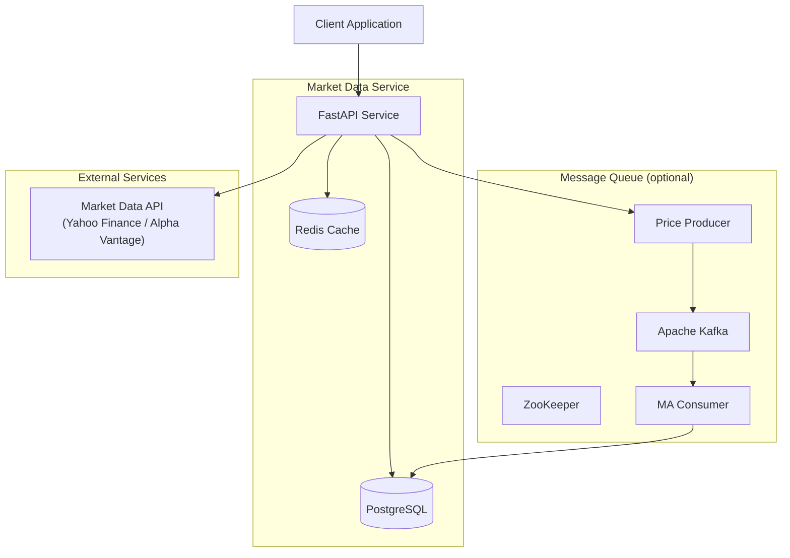
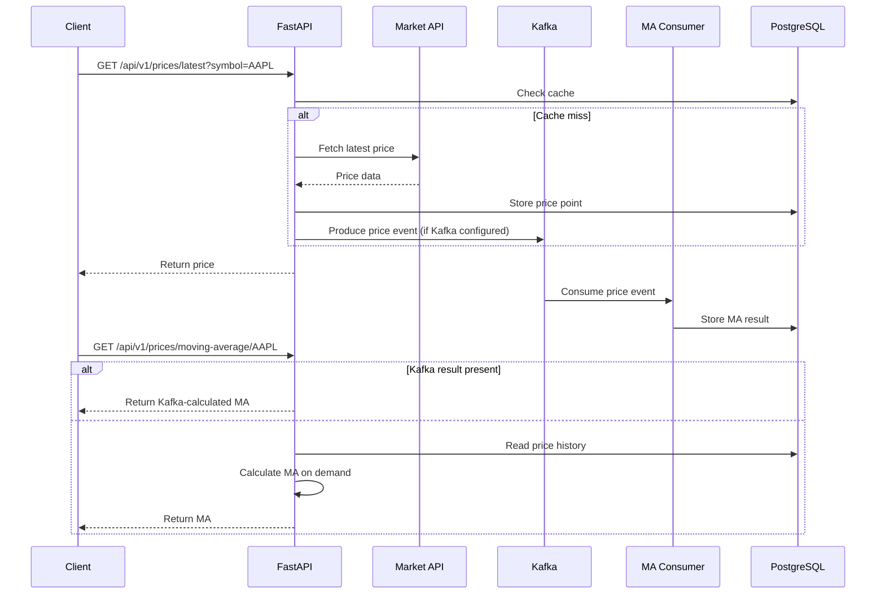

# Market Data Service

[](https://github.com/Vrajesh-works/Market-Data-Service/actions/workflows/lint.yml)
[](https://github.com/Vrajesh-works/Market-Data-Service/actions/workflows/test.yml)
[](https://github.com/Vrajesh-works/Market-Data-Service/actions/workflows/docker.yml)

A production-ready microservice that fetches market data, processes it through a streaming pipeline, and serves it via REST APIs. Built with FastAPI, PostgreSQL, and Apache Kafka for real-time data processing.

## Live Demo

The API is deployed and publicly accessible:

- **API base**: https://market-data-service-e0l6.onrender.com
- **Swagger UI**: https://market-data-service-e0l6.onrender.com/docs
- **Health check**: https://market-data-service-e0l6.onrender.com/health

Try it:

```bash
# Health check
curl https://market-data-service-e0l6.onrender.com/health

# Latest price for AAPL (served by the keyless Yahoo Finance provider)
curl "https://market-data-service-e0l6.onrender.com/api/v1/prices/latest?symbol=AAPL"
```

## Overview

This service provides:

- **Real-time market data** from pluggable providers (Yahoo Finance by default, no API key needed; Alpha Vantage as an optional keyed provider)
- **Database persistence** with PostgreSQL for historical data
- **Streaming data pipeline** using Apache Kafka for real-time processing (optional; the API degrades gracefully without it)
- **Moving averages** calculated by Kafka consumers when available, or computed on demand from stored price history
- **REST API endpoints** for data access and job management
- **Polling jobs** for continuous data collection

## Architecture

### System Diagram


```mermaid
graph TB
    subgraph "Market Data Service"
        API["FastAPI Service"]
        DB[(PostgreSQL)]
        Cache[("Redis Cache<br/>")]
    end

    subgraph "Message Queue (optional)"
        Kafka["Apache Kafka"]
        ZK["ZooKeeper"]
        Producer["Price Producer"]
        Consumer["MA Consumer"]
    end

    subgraph "External Services"
        MarketAPI["Market Data API<br/>(Yahoo Finance / Alpha Vantage)"]
    end

    Client["Client Application"] --> API
    API --> DB
    API --> Cache
    API --> MarketAPI

    API --> Producer
    Producer --> Kafka
    Kafka --> Consumer
    Consumer --> DB
```

### Data Flow


```mermaid
sequenceDiagram
    participant C as Client
    participant A as FastAPI
    participant M as Market API
    participant K as Kafka
    participant MA as MA Consumer
    participant DB as PostgreSQL

    C->>A: GET /api/v1/prices/latest?symbol=AAPL
    A->>DB: Check cache
    alt Cache miss
        A->>M: Fetch latest price
        M-->>A: Price data
        A->>DB: Store price point
        A->>K: Produce price event (if Kafka configured)
    end
    A-->>C: Return price

    K->>MA: Consume price event
    MA->>DB: Store MA result

    C->>A: GET /api/v1/prices/moving-average/AAPL
    alt Kafka result present
        A-->>C: Return Kafka-calculated MA
    else
        A->>DB: Read price history
        A->>A: Calculate MA on demand
        A-->>C: Return MA
    end
```

## Quick Start

### Prerequisites

- Python 3.11+
- Docker and Docker Compose (for local PostgreSQL, Kafka, Redis)

### 1. Clone and Setup

```bash
git clone https://github.com/Vrajesh-works/Market-Data-Service.git
cd Market-Data-Service

python -m venv venv
source venv/bin/activate  # On Windows: venv\Scripts\activate

pip install -r requirements/base.txt
```

### 2. Environment Configuration

```bash
cp .env.example .env
```

The only required variable for the basic demo is `DATABASE_URL`. The Yahoo Finance provider needs no API key. Set `ALPHA_VANTAGE_API_KEY` only if you want the Alpha Vantage provider, and `KAFKA_BOOTSTRAP_SERVERS` only if you want the streaming pipeline.

### 3. Start Infrastructure (optional)

```bash
# PostgreSQL alone is enough for the basic demo
docker-compose up postgres -d

# Add Kafka and Redis for the full streaming pipeline
docker-compose up postgres redis zookeeper kafka -d
```

### 4. Initialize Database

```bash
python scripts/setup_database.py
```

### 5. Start the Application

```bash
# API server
uvicorn app.main:app --reload --host 0.0.0.0 --port 8000

# Kafka consumer (only if Kafka is running)
python scripts/run_kafka_consumer.py
```

### 6. Verify

```bash
curl http://localhost:8000/health
curl "http://localhost:8000/api/v1/prices/latest?symbol=AAPL"
```

Interactive docs: http://localhost:8000/docs

## API Documentation

Interactive Swagger UI is available at `/docs` on any deployment.

Endpoints cover:

- Market data retrieval (latest prices, historical data)
- Moving averages calculation
- Polling job management
- System health monitoring

A Postman collection is provided in `docs/postman_collection.json`. Import it into Postman, set `base_url` to your deployment, and run the pre-configured requests.

## Configuration

### Environment Variables

| Variable | Description | Default | Required |
|----------|-------------|---------|----------|
| `DATABASE_URL` | PostgreSQL connection string | - | Yes |
| `DEFAULT_PROVIDER` | Default market data provider | `yahoo` | No |
| `ALPHA_VANTAGE_API_KEY` | Alpha Vantage API key (enables that provider) | - | No |
| `KAFKA_BOOTSTRAP_SERVERS` | Kafka server addresses (enables streaming pipeline) | `localhost:9092` | No |
| `REDIS_URL` | Redis connection string | `redis://localhost:6379` | No |
| `CACHE_TTL` | Cache time-to-live (seconds) | `300` | No |

### Market Data Providers

#### Yahoo Finance (default)

- No API key required
- Used automatically when no other provider is configured

#### Alpha Vantage (optional)

- Rate limit: 5 calls per minute on the free tier
- Get a free key at [alphavantage.co](https://www.alphavantage.co/support/#api-key) and set `ALPHA_VANTAGE_API_KEY`

## Database Schema

### `raw_market_data`

Stores complete API responses for audit trail.

```sql
- id (UUID, Primary Key)
- symbol (String, Indexed)
- provider (String)
- raw_response (JSONB)
- timestamp (DateTime, Indexed)
- created_at (DateTime)
```

### `processed_price_points`

Extracted and normalized price data.

```sql
- id (UUID, Primary Key)
- symbol (String, Indexed)
- price (Float)
- timestamp (DateTime, Indexed)
- provider (String)
- raw_response_id (UUID, Foreign Key)
- created_at (DateTime)
```

### `moving_averages`

Calculated moving averages for different periods.

```sql
- id (UUID, Primary Key)
- symbol (String, Indexed)
- moving_average (Float)
- period (Integer)
- timestamp (DateTime, Indexed)
- created_at (DateTime)
```

### `polling_job_configs`

Persistent polling job configurations.

```sql
- id (UUID, Primary Key)
- job_id (String, Unique)
- symbols (JSONB)
- interval (Integer)
- provider (String)
- status (String)
- created_at, updated_at (DateTime)
- last_run, next_run (DateTime)
- error_message (Text)
```

## Kafka Integration (optional)

When `KAFKA_BOOTSTRAP_SERVERS` points at a running broker, price events stream through Kafka and moving averages are calculated by consumers. Without Kafka, the API still works: moving averages are computed on demand from stored price history.

### Topics

#### `price-events`

Raw price updates from market data APIs.

```json
{
  "symbol": "AAPL",
  "price": 196.45,
  "timestamp": "2025-06-14T18:05:48.660453",
  "source": "yahoo",
  "raw_response_id": "uuid-here"
}
```

#### `symbol_averages`

Calculated moving averages from consumers.

```json
{
  "symbol": "AAPL",
  "moving_average": 195.82,
  "period": 5,
  "timestamp": "2025-06-14T18:05:48.660453",
  "calculated_at": "2025-06-14T18:05:50.123456"
}
```

Consumer group `moving-average-calculator` processes price events and calculates moving averages.

## Project Structure

```
Market-Data-Service/
├── app/
│   ├── api/
│   │   ├── routes/
│   │   │   └── prices.py          # Price API endpoints
│   │   └── dependencies.py        # FastAPI dependencies
│   ├── core/
│   │   ├── config.py              # Configuration settings
│   │   └── database.py            # Database connection
│   ├── models/
│   │   └── database.py            # SQLAlchemy models
│   ├── services/
│   │   ├── market_data.py         # Market data service
│   │   ├── data_access.py         # Database operations
│   │   ├── kafka_producer.py      # Kafka message producer
│   │   ├── kafka_consumer.py      # Kafka message consumer
│   │   └── providers/
│   │       ├── base.py            # Provider interface
│   │       ├── alpha_vantage.py   # Alpha Vantage provider
│   │       └── yahoo.py           # Yahoo Finance provider
│   ├── schemas/
│   │   └── prices.py              # Pydantic schemas
│   └── main.py                    # FastAPI application
├── scripts/
│   ├── setup_database.py         # Database initialization
│   ├── setup_kafka.py            # Kafka topic creation
│   └── run_kafka_consumer.py     # Consumer runner
├── requirements/
│   ├── base.txt                   # Production dependencies
│   └── dev.txt                    # Development dependencies
├── docker-compose.yml            # Infrastructure services
├── .env.example                  # Environment template
└── README.md                     # This file
```

## Testing

```bash
# Install development dependencies
pip install -r requirements/dev.txt

# Run all tests
python scripts/run_tests.py --type all

# Run specific test types
python scripts/run_tests.py --type unit
python scripts/run_tests.py --type integration
python scripts/run_tests.py --type functional

# Coverage report
pytest --cov=app tests/
```

## CI/CD

GitHub Actions runs on every push and pull request:

- **Lint**: flake8, black, isort
- **Test**: unit and integration tests with coverage
- **Docker**: validates the Docker image builds

Build the Docker image locally:

```bash
docker build -t market-data-service .

docker run -p 8000:8000 -e DATABASE_URL=<your-db-url> market-data-service
```
